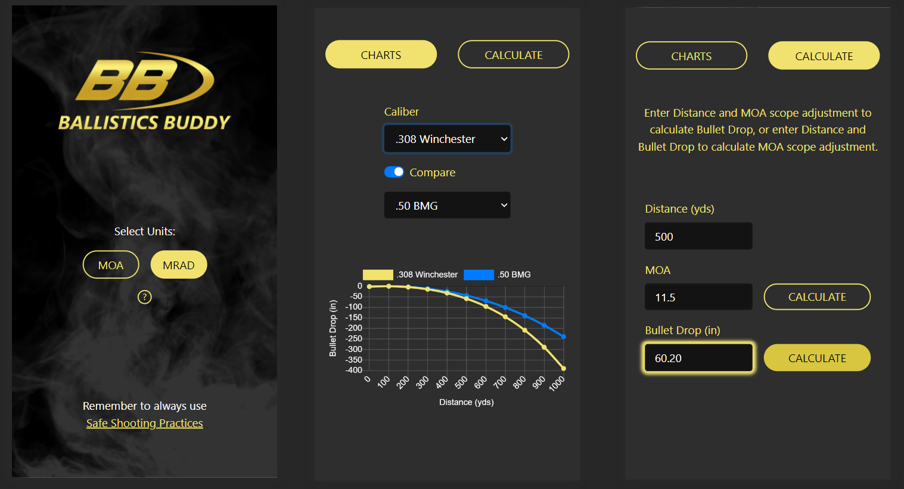

# ballistics-buddy

A full stack JavaScript/React web app for long-range hobby shooters to view and calculate ballistics data

## Live Demo

Try the application live at [https://ballistics-buddy.herokuapp.com](https://ballistics-buddy.herokuapp.com)

## Features

- Users can choose scope adjustment units (MOA/MRAD)
- Users can choose a caliber and view ballistics chart/table
- Users can compare ballistics for two calibers
- Users can calculate MOA/MRAD scope adjustments
- Users can calculate bullet drop

## Preview

